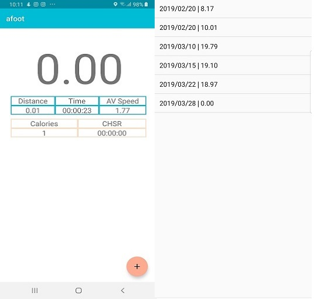

##AFOOT

Расчет времени, расстояния и калорий для пеших прогулок. В начале
прогулки требуется запустить приложение и нажать старт. В режиме прогулки
отображается пройденное расстояние, время, средняя и мгновенная скорость. А также
счетчик калорий.

При нажатии кнопки стоп формируется отчет о прогулках с их расстоянием.
